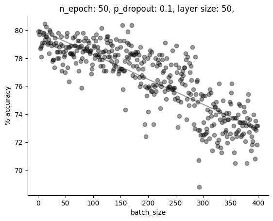
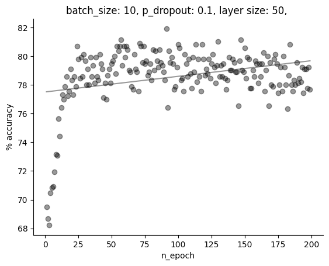
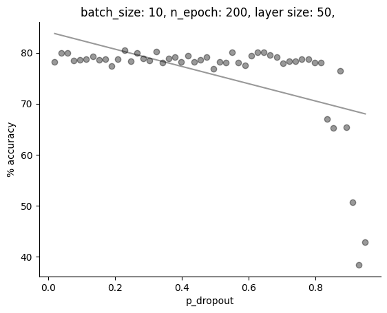
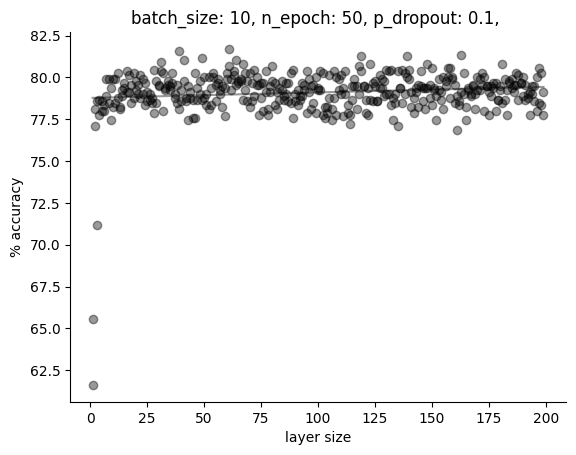

# Titanic 
I wanted to see what the fuss about the Titanic Kaggle competition was, so I decided to have a go with a PyTorch fully connected neural network with dropout.

### Hyperparameter selection
After coming up with a preliminary network, I assumed the parameters batch size, number of epochs, dropout probability and layer size (same for both layers) behaved independently. So keeping the others constant, I tested a range of values for each hyperparameter:

<h3> Batch size </h1>

 
    

    Clearly the lower the batchsize the better the performance, possibly because finer details are lost in generalisation.
    

<h3> Number of epochs </h1>

 
    

    At very few iterations over the dataset gradient descent has not yet found a (local) minimum, although after 25 epochs the accuracy plateaus. 
    

<h3> Dropout rate </h1>

 
    

    My implementation of dropout made little difference to test accuracy except at very high rates, which completely impaired model training. This suggests that the model wasn't overfitting in the first place.
    

<h3> Layer size (both equal) </h1>

 
    

    I was surprised the model didn't overfit with models with more nodes. This is something to investigate.
    

### Conclusions
My assumption of hyperparameter independence might not hold, for example in higher dropout rates which may require more epochs to properly train. However, I didn't quite fancy working with 4-dimensional data for visualisation and computation constraints! Keeping with my assumptions and reading off from the graphs, an effective but efficient model may have `batchsize = 5, n_epoch = 25, p_dropout = 0.05 (redundant), layerize = 10`. Indeed this configuration results in 75-80% average accuracy over 3-fold train-test splitting.

Curiously, the predictions I submitted were just below 75% in accuracy (74.6). Future work may involve umderstanding why my internal testing resulted in more optimistic accuracies(averaging around 80%) and how other other architectures or even separate machine learning techniques may compare.